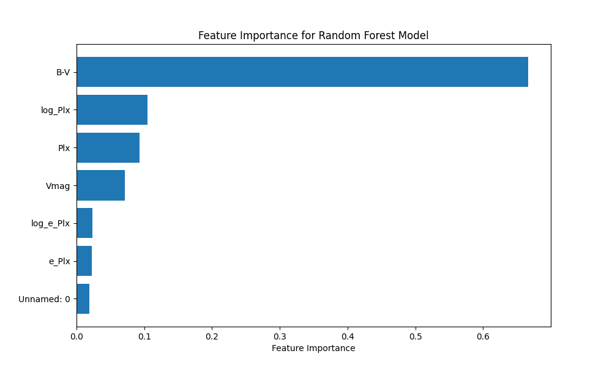

# Stellar Classification Project

## Overview

The Stellar Classification Project aims to classify stars into giant and dwarf categories using spectral data and machine learning models. The project involves several steps, including data loading, cleaning, exploration, transformation, and model training with hyperparameter tuning. The workflow is designed to preprocess the data, perform exploratory data analysis, apply necessary transformations, and build a machine learning model to achieve high classification accuracy.

## Project Structure

- **load.py**: Loads the original dataset.
- **clean.py**: Cleans the dataset by handling missing values, outliers, and normalizing the data.
- **explore.py**: Performs exploratory data analysis on the cleaned dataset.
- **log_transformation.py**: Applies log transformation to reduce skewness in the data.
- **transformation_analysis.py**: Analyzes the transformed data and generates visualizations.
- **random_forest.py**: Trains a Random Forest model on the transformed data.
- **hyperparameter_tuning.py**: Tunes the hyperparameters of the Random Forest model for optimal performance.

## Workflow

### 1. Loading the Dataset

The `load.py` script loads the original dataset from a CSV file and returns a pandas DataFrame.

#### Libraries Used:
- `pandas`
- `os`

### 2. Data Cleaning

The `clean.py` script cleans the dataset by handling missing values, outliers, and normalizing the data.

#### Libraries Used:
- `pandas`
- `numpy`
- `sklearn.preprocessing.MinMaxScaler`

### 3. Exploratory Data Analysis

The `explore.py` script performs exploratory data analysis on the cleaned dataset, including generating summary statistics and visualizations.

#### Libraries Used:
- `pandas`
- `seaborn`
- `matplotlib.pyplot`

### 4. Log Transformation

The `log_transformation.py` script applies log transformation to reduce skewness in the data and further cleans the data.

#### Libraries Used:
- `pandas`
- `numpy`
- `sklearn.preprocessing.MinMaxScaler`

### 5. Transformation Analysis

The `transformation_analysis.py` script analyzes the transformed data and generates visualizations to understand the distribution and correlations.

#### Libraries Used:
- `pandas`
- `seaborn`
- `matplotlib.pyplot`

### 6. Random Forest Model

The `random_forest.py` script trains a Random Forest model on the transformed data and evaluates its performance. It also saves the model and performance metrics.

#### Libraries Used:
- `pandas`
- `sklearn.model_selection.train_test_split`
- `sklearn.ensemble.RandomForestClassifier`
- `sklearn.metrics.classification_report`
- `sklearn.metrics.confusion_matrix`
- `sklearn.metrics.accuracy_score`
- `joblib`
- `matplotlib.pyplot`

### 7. Hyperparameter Tuning

The `hyperparameter_tuning.py` script tunes the hyperparameters of the Random Forest model using GridSearchCV to find the best parameters for optimal performance.

#### Libraries Used:
- `pandas`
- `sklearn.model_selection.train_test_split`
- `sklearn.ensemble.RandomForestClassifier`
- `sklearn.metrics.classification_report`
- `sklearn.metrics.confusion_matrix`
- `sklearn.metrics.accuracy_score`
- `sklearn.model_selection.GridSearchCV`
- `joblib`
- `matplotlib.pyplot`

## Results

### Performance Metrics

The performance of the final Random Forest model is summarized below:

- **Accuracy**: 0.9028
- **Confusion Matrix**: 
  ```
  [[7020  344]
   [ 912 4642]]
  ```
- **Classification Report**:
  ```
                 precision    recall  f1-score   support

             0       0.89      0.95      0.92      7364
             1       0.93      0.84      0.88      5554

      accuracy                           0.90     12918
     macro avg       0.91      0.89      0.90     12918
  weighted avg       0.90      0.90      0.90     12918
  ```

### Feature Importance

The importance of each feature used in the final Random Forest model is visualized below:



## Usage

1. Clone the repository.
2. Ensure all dependencies are installed.
3. Follow the workflow by executing each script in the specified order.

## Contributing

Contributions are welcome. Please fork the repository and create a pull request with your changes.

## License

This project is licensed under the MIT License.
